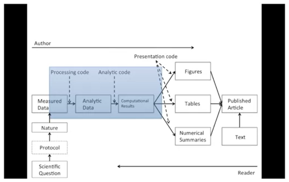
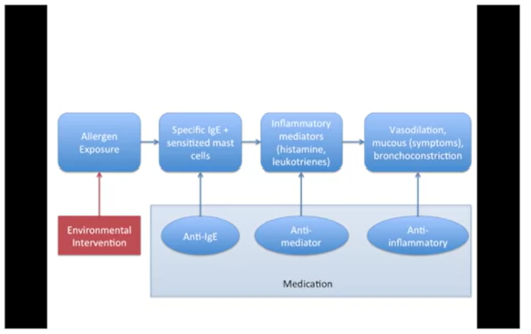
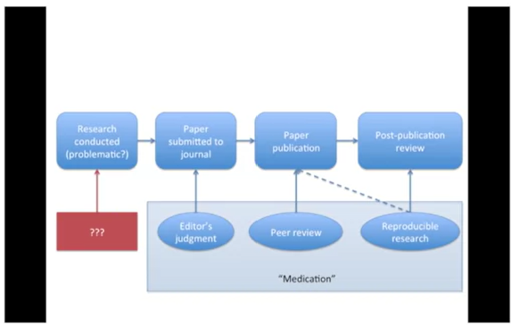
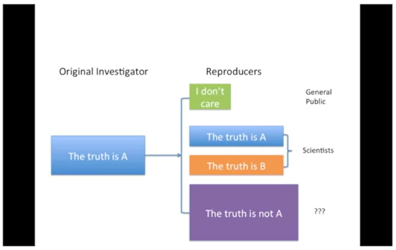
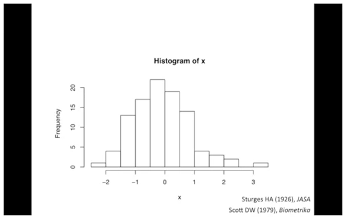
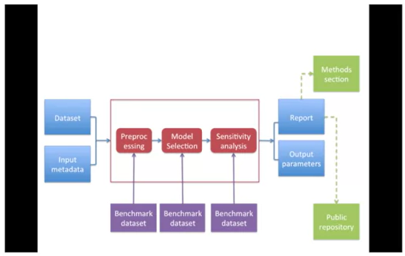
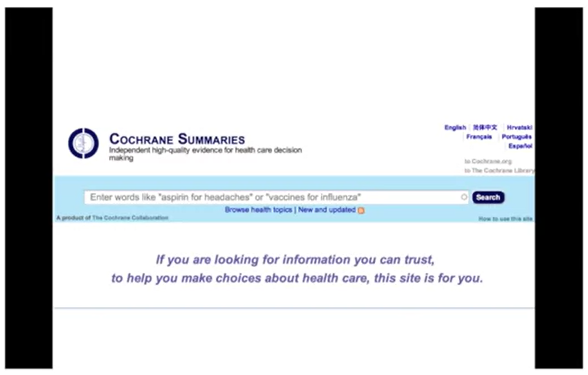
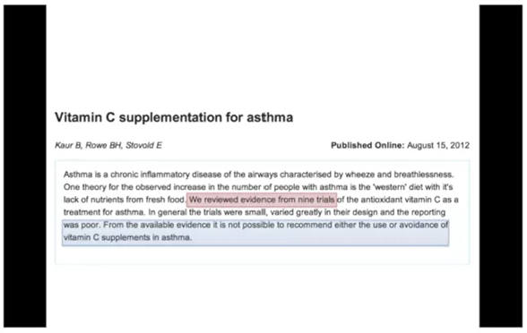

# Communicating Results

## tl;dr

* People are busy, especially managers and leaders
* Results of data analyses are sometimes presented in oral form, but often the first cut is presented via email
* It is often useful to breakdown the results of an analysis into different levels of granularity / detail

## Hierarchy of information

### Research paper

* Title / author list
* Abstract
* Body / results
* Supplementary materials / the gory details
* Code / data / really gory details

### Email presentation

* Subject line / sender info
    * At a minimum; include one
    * Can you summarise findings in one sentence?
    
* Email body
    * A brief description of the problem / context; recall what was proposed and executed; summarise findings / results / 1-2 paragraphs
    * If action needs to be taken as a result of this presentation, suggest some options and make them as concrete as possible
    * If questions need to be addressed, try to make them yes/no

* Attachment(s)
    * R Markdown file
    * knitr report
    * Stay concise: don't spit out pages of code (because you used knitr we know it's available)

* Links to supplementary materials
    * code / software / data
    * GitHub repository / project web site

# RPubs

rpubs.com

*Easy web publishing from R*

Write **R Markdown** documents in RStudio
Share them on RPubs. (It's free, and couldn't be simpler!)

From a knitted document, click on Publish (top right) and choose RPubs

Alternatively, open the html document in the editor and click on Preview ... and from the preview version click on Publish

Content is immediately public, so be careful what you publish!

Of course you can delete content at any time.


# Reproducible Research Checklist

## DO: Start with good science

* Garbage in, garbage out
* Coherent, focused question simplifies many problems
* Working with good collaborators reinforces good practices
* Something that is interesting to you will (hopefully) motivate good habits

## DON'T: Do things by hand

* Editing spreadsheets of data to "clean it up"
    * removing outliers
    * QA / GC
    * Validating
* Editing tables or figures (e.g. rounding, formatting)
* Downloading data from a website (clicking links in a web browser)
* Moving data around your computer; splitting / reformatting data files
* Very tempting to think: "We're just going to do this once ..."

Things done by hand need to be precisely documented (this is harder than it sounds)

## DON'T: Point and click

* Many data processing / statistical analysis packages have graphical user interfaces (GUIs)
* GUIs are convenient / intuitive but the actions you take with a GUI can be difficult for others to reproduce
* Some GUIs produce a log file or script which includes equivalent commands; these can be saved for later examination
* In general, be careful with data analysis software that is highly *interactive*; ease of use can sometimes lead to non-reproducbile analyses
* Other interactive software, such as text editors, are usually fine

## Do: Teach a computer

* If something needs to be done as part of your analysis / investigation, try to teach your computer to do it (even if you only need to do it once)
* In order to give your computer instructions, you need to write down exactly what you mean to do and how it should be done
* Teaching a computer almost guarantees reproducibility

For example, by hand you can:

1. Go to the UCI Machine Learning Repository at https://archive.ics.uci.edu/ml/index.php
2. Download the [Bike Sharing Dataset](https://archive.ics.uci.edu/ml/datasets/bike+sharing+dataset) by clicking on the Data Folder, then clicking on the link to the zip file of dataset, and choosing "Save Linked File As..." and then saving it to a folder on your computer

Or ... you can teach your computer to do the same thing using R:

```{r}
download.file("https://archive.ics.uci.edu/ml/machine-learning-databases/00275/Bike-Sharing-Dataset.zip", "./data/Bike-Sharing-Dataset.zip")
```

Notice here that:
* The full URL to the dataset is specified (no clicking through a series of links)
* The name of the file saved to your local computer is specified
* The directory in which the file was saved is specified ("data")
* Code can always be executed in R (as long as the link is available)

## DO: Use some version control

* Slow things down
* Add changes in small chunks (don't just do one massive commit)
* Track / tag snapshots; revert to old versions
* Software like GitHub / BitBucket / SourceForge make it easy to publish results

## DO: Keep track of your software environment

* If you work on a complex project involving many tools / datasets, the software and computing environment can be critical for reproducing your analysis
* **Computer architecture**: CPU (Intel, AMD, ARM), GPUs
* **Operating system**: Windows, MAC OS, Linux / Unix
* **Software toolchain**: Compilers, interpreters, command shell, programming languages (C, Perl, Python, etc.), database backends, data analysis software
* **Supporting software / infrastructure**: Libraries, R packages, dependencies
* **External dependencies**: Websites, data repositories, remote databases, software repositories
* **Version numbers**: Ideally, for everything (if available)

```{r}
sessionInfo()
```

## DON'T: Save output

* Avoid saving data analysis output (tables, figures, summaries, processed data, etc), except perhaps temporarily for efficiency purposes
* If a stray output file cannot be easily connected with the means by which it was created, then it is not reproducible
* Save the data + code that generated the output, rather than the output itself
* Intermediate files are okay as long as there is clear documentation of how they were created

## DO: Set your seed

* Random number generators generate pseudo-random numbers based on an initial seed (usually a number or set of numbers)
    * In R you can use the **set.seed()** function to set the seed and to specify the random number generator to use
* Setting the seed allows for the stream of random numbers to be exactly reproducible
* Whenever you generate random numbers for a non-trivial purpose, **always set the seed**

## DO: Think about the entire pipeline

* Data analysis is a lengthy process: it is not just tables / figures / reports
* Raw data --> processed data --> analysis --> report
* How you got to the end is just as important as the end itself
* The more of the data analysis pipeline you can make reproducible, the better for everyone

## Summary: Checklist

* Are we doing good science
* Was any part of this analysis done by hand?
    * If so, are those parts *precisely* documented?
    * Does the documentation match reality?
* Have we taught the computer to do as much as possible (i.e. coded)?
* Are we using a version control system?
* Have we documented our software environment?
* Have we saved any output that we cannot reconstruct from original data + code?
* How far back in the analysis pipeline can we go before our results are no longer (automatically) reproducible?


# Evidence-based Data Analysis

## Replication and reproducibility

Replication

* Focuses on the validity of the scientific claim
* "Is the claim true?"
* The ultimate standard for strengthening scientific evidence
* New investigators, data, analytical methods, laboratories, instruments, etc.
* Particularly important in the studies that can impact broad policy or regulatory decisions

Reproducibility

* Focuses on the validity of the data analysis
* Can we trust this analysis?"
* Arguably a minimum standard for any scientific study
* New investigators, same data, same methods
* Important when replication is impossible

## Background and underlying trends

* Some studies cannot be replicated: no time, no money, unique/opportunistic
* Technology is increasing data collection throughput; data are more complex and high-dimensional
* Existing databases can be merged to become bigger databases (but data are used off-label)
* Computing power allows more sophisticated analyses, even on "small data"
* For every field "X" there is a "Computational X"

## The result?

* Even basic analyses are difficult
* Heavy computational requirements are thrust upon people without adequate training in statistics and computing
* Errors are more easily introduced into long analysis pipelines
* Knowledge transfer is inhibited
* Results are difficult to replicate or reproduce
* Complicated analyses cannot be trusted

## What is reproducibility?



## What problem does reproducibility solve?

What we get

* transparency
* data availability
* software / methods availability
* improved transfer of knowledge

What we do NOT get

* validity / correctness of the analysis

An analysis can be reproducible and still be wrong

We want to know "can we trust this analysis?"

Does requiring reproducibility deter bad analysis?


## Problems with reproducibility

The premise of reproducible research is that with data/code available, people can check each other and the whole system is self-correcting

* Addresses the most "downstream" aspect of the research process - post publication

* Assumes everyone plays by the same rules and wants to achieve the same goals (i.e. scientific discovery)


## An analogy from asthma




## Scientific dissemination process




## Who reproduces research?

* For reproducibility to be effective as a means to check validity, someone needs to do something

    * Re-run the analysis; check results match
    * Check the code for bugs / errors
    * Try alternate approaches; check sensitivity
* The need for someone to do something is inherited from the traditional notion of replication
* Who is the "someone" and what are their goals?


Three kinds of people who reproduce research



## The story so far

* Reproducibility brings transparency (wrt code+data) and increased transfer of knowledge
* A lot of discussion about how to get people to share data
* Key question of "can we trust this analysis?" is not addressed by reproducibility
* Reproducibility addresses potential problems long after they've occurred ("downstream")
* Secondary analyses are inevitably coloured by the interests / motivations of others


## Evidence-based data analysis

* Most data analyses involve stringing together many different tools and methods
* Some methods may be standard for a given field, but others are often applied *ad hoc*
* We should apply thorogouhly studied (via statistical research), mutually agreed upon methods to analyze data whenever possible
* There should be evidence to justify the application of a given method

Take a standard histogram generated in R ... the bandwidth is generated automatically




* Create analytic pipelines from evidence-based components - standardize it
* Once an evidence-based analytic pipeline is established, we shouldn't mess with it
* Analysis with a "transparent box"
* Reduce the "researcher degree of freedom"
* Analogous to a pre-specified clinical trial protocol


### Deterministic statistical machine



## Case study: Estimating acute effects of ambient air pollution exposure

* Acute / short-terms effects typically estimated via panel studies or time series studies
* Work originated in the late 1970s early 1980s
* Key question: "Are short-term changes in pollution associated with short-term changes in a population health outcome?"
* Studies usually conducted at community level
* Long history of statistical research investigating proper methods of analysis

* Can we encode everything that we have found in statistical / epidemiological research into a single package?
* Time series studies do not have a huge range of variation; typically involves similar types of data and similar questions
* We can create a deterministic statistical machine for this area


## DSM modules for time series studies of air pollution and health

1. Check for outliers, hig leverage, overdispersion
2. Fill in missing data? NO!
3. Model selection: estimate degrees of freedom to adjust for unmeasured confounders
    * other aspects of model not as critical
4. Multiple lag analysis
5. Sensitivity analysis wrt
    * unmeasured confounder adjustment
    * influential points


## Where to go from here?

* One DSM is not enough, we need many!
* Different problems warrant different approaches and expertise
* A curated library of machines providing state-of-the art analysis pipelines
* A CRAN / CPAN / CTAN / ... for data analysis
* Or a "Cochrane Collaboration" for data analysis


### A model: Cochrane Collaboration (evidence-based medicine)






## A curated library of data analysis

* Provide packages that encode data analysis pipelines for given problems, technologies, questions
* Curated by experts knowledgeable in the field
* Documentation / references given supporting each module in the pipeline
* Changes introduced after passing relevant benchmarks / unit tests


# Summary

* Reproducible research is important, but does not necessarily solve the critical question of whether a data analysis is trustworthy
* Reproducible research focuses on the most "downstream" aspect of research dissemination
* Evidence-based data analysis would provide standardised, best practices for given scientific areas and questions
* Gives reviewers an important tool without dramatically increasing the burden on them
* More effort should be put into improving the quality of "upstream" aspects of scientific research


