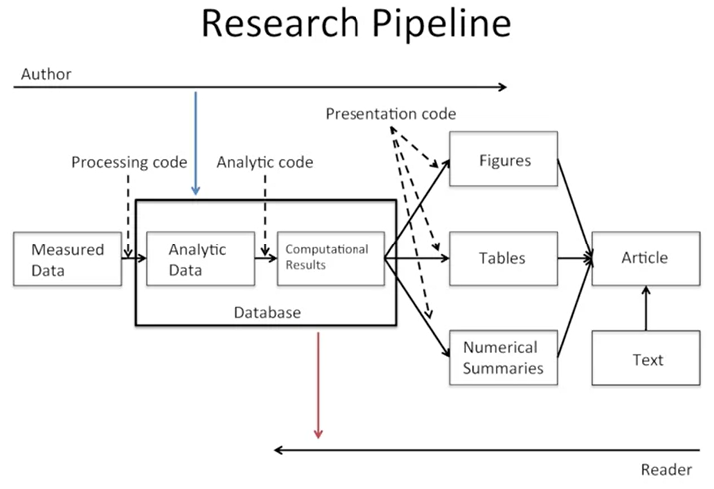
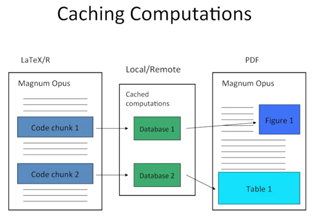
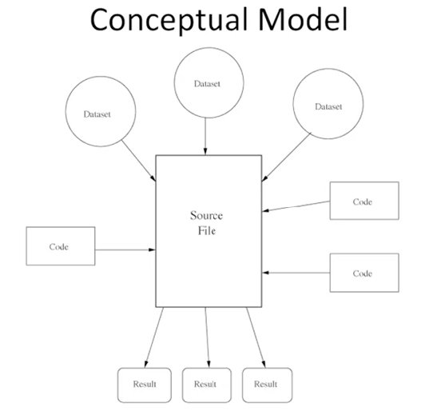
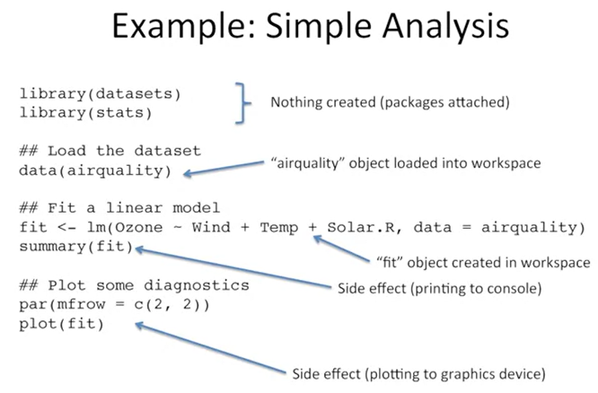

```{r setup, include=FALSE}
knitr::opts_chunk$set(echo = TRUE)
```

# Caching Computations

## Literate (statistical) programming

* An article is a stream of **text** and **code**
* Analysis code is divided into text and code "chunks"
* Each code chunk loads data and computes results
* Presentation code formats results (tables, figures, etc.)
* Article text explains what is going on
* Literate programs can be **weaved** to produce human-readable documents and **tangled** to produce machine-readable documents

* Literate programming is a general concept that requires:
    1. A documentation language (human readable)
    2. A programming language (machine readable)
* Sweave uses LATEX and R as the documentation and programming languages
* Sweave was developed by Friedrich Leisch (member of the R Core) and maintained by R Core
* Alternatives to LATEX/R exist, such as HTML/R (package R2HTML) and ODF/R (package odfWeave)








## The cacher package for R

* Add-on package for R
* Evaluates code written in files and stores intermediate results in a key-value database
* R expressions are given SHA-1 hash values so that changes can be tracked and code reevaluated if necessary
* "Cacher packages" can be built for distribution
* Others can "clone" an analysis and evaluate subsets of code or inspect data objects




## Using a cacher as an author

1. Parse the R source file; create the necessary cache directories and subdirectories
2. Cycle through each expression in the source file:
    * If an expression has never been evaluated, evaluate it and store any resulting R objects in the cache database
    * If a cached result exists, lazy-load the results from the cache database and move to the next expression
    * If an expression does not create any R objects (i.e., there is nothing to cache), add the expressioin to the list of expressions where evaluation needs to be forced
    * Write out metadata for this expression to the metadata file

* The cachepackage function creates a cacher package storing
    * source file
    * cached data objects
    * metadata
* Package file is zipped and can be distributed
* Readers can unzip the file and immediately investigate its contents via cacher package




## Using cacher as a reader

A journal article may say:

*... the code and data for this analysis can be found in the cacher package 092dcc7dda4b93e42f3e038a60e1d44dbec7b3f.*

> library(cacher)
> clonecache(id = "092dcc7dda4b93e42f3e038a60e1d44dbec7b3f")
> clonecache(id = "092d")  ## same as above
created cache directory '.cache'

> showfiles()
[1] "top20.R"
> sourcefile("top20.r)


## Cloning an analysis

* Local directories created
* Source code files and metadata are downloaded
* Data objects are *not* downloaded by default
* References to data objects are loaded and corresponding data can be lazy-loaded on demand


## Running code

* The runcode function executes code in the source file
* By default, expressions that result in an object being created are *not* run and the resulting object is lazy-loaded into the workspace
* Expressions not resulting in objects are evaluated


## Checking code and objects

* The checkcode function evaluates all expressions from scratch (no lazy-loading)
* Results of evaluation are checked against stored results to see if the results are the same as what the author calculated
    * setting RNG seeds is critical for this to work
* The integrity of data objects can be verified with the checkobjects function to check for possible corrupton of data (i.e. in transit)


## Cacher summary

* The cacher package can be used by authors to create cache packages from data analyses for distribution
* Readers can use the cacher package to inspect others' data analyses by examining cached computations
* Cacher is mindful of readers' resources and efficiently loads only those data objects that are needed


