```{r setup, include=FALSE}
knitr::opts_chunk$set(echo = TRUE)
```

# Caching Computations

## Literate (statistical) programming

* An article is a stream of **text** and **code**
* Analysis code is divided into text and code "chunks"
* Each code chunk loads data and computes results
* Presentation code formats results (tables, figures, etc.)
* Article text explains what is going on
* Literate programs can be **weaved** to produce human-readable documents and **tangled** to produce machine-readable documents

* Literate programming is a general concept that requires:
    1. A documentation language (human readable)
    2. A programming language (machine readable)
* Sweave uses LATEX and R as the documentation and programming languages
* Sweave was developed by Friedrich Leisch (member of the R Core) and maintained by R Core
* Alternatives to LATEX/R exist, such as HTML/R (package R2HTML) and ODF/R (package odfWeave)


## The cacher package for R

* Add-on package for R
* Evaluates code written in files and stores intermediate results in a key-value database
* R expressions are given SHA-1 hash values so that changes can be tracked and code reevaluated if necessary
* "Cacher packages" can be built for distribution
* Others can "clone" an analysis and evaluate subsets of code or inspect data objects


## Using a cacher as an author

1. Parse the R source file; create the necessary cache directories and subdirectories
2. Cycle through each expression in the source file:
    * If an expression has never been evaluated, evaluate it and store any resulting R objects in the cache database
    * If a cached result exists, lazy-load the results from the cache database and move to the next expression
    * If an expression does not create any R objects (i.e., there is nothing to cache), add the expressioin to the list of expressions where evaluation needs to be forced
    * Write out metadata for this expression to the metadata file

* The cachepackage function creates a cacher package storing
    * source file
    * cached data objects
    * metadata
* Package file is zipped and can be distributed
* Readers can unzip the file and immediately investigate its contents via cacher package


## Using cacher as a reader

A journal article may say:

*... the code and data for this analysis can be found in the cacher package 092dcc7dda4b93e42f3e038a60e1d44dbec7b3f.*

> library(cacher)
> clonecache(id = "092dcc7dda4b93e42f3e038a60e1d44dbec7b3f")
> clonecache(id = "092d")  ## same as above
created cache directory '.cache'

> showfiles()
[1] "top20.R"
> sourcefile("top20.r)


## Cloning an analysis

* Local directories created
* Source code files and metadata are downloaded
* Data objects are *not* downloaded by default
* References to data objects are loaded and corresponding data can be lazy-loaded on demand


## Running code

* The runcode function executes code in the source file
* By default, expressions that result in an object being created are *not* run and the resulting object is lazy-loaded into the workspace
* Expressions not resulting in objects are evaluated


## Checking code and objects

* The checkcode function evaluates all expressions from scratch (no lazy-loading)
* Results of evaluation are checked against stored results to see if the results are the same as what the author calculated
    * setting RNG seeds is critical for this to work
* The integrity of data objects can be verified with the checkobjects function to check for possible corrupton of data (i.e. in transit)


## Cacher summary

* The cacher package can be used by authors to create cache packages from data analyses for distribution
* Readers can use the cacher package to inspect others' data analyses by examining cached computations
* Cacher is mindful of readers' resources and efficiently loads only those data objects that are needed


# Case Study: Air Pollution

## What causes particulate matter (PM) to be toxic?

* PM is composed of many different chemical elements
* Some components of PM may be more harmful than others
* Some sources of PM may be more dangerous than others
* Identifying harmful chemical constituents may lead us to strategies for controlling sources of PM


## NMMAPS

* The National Morbidity, Mortality and Air Pollution Study (NMMAPS) was a national study of the short-term health effects of ambient pollution
* Focused primarily on particulate matter (PM10) and ozone (O3)
* Health outcomes included mortality from all causes and hospitalizations for cardiovascular and respiratory disease
* Key publications
    * http://www.ncbi.nlm.nih.gov/pubmed/11098531
    * http://www.ncbi.nlm.nih.gov/pubmed/11354823

## NMMAPS and reproducibility

* Data made available at the Internet-based Health and Air Pollution Surveillance System (http://www.ihapss.jhsph.edu)#
* Research results and software also available at iHAPSS
* Many studies (over 67 published) have been conducted based on the public data http://www.ncbi.nlm.nih.gov/pubmed/22475833
* Has served as an important test bed for methodological development


## What causes particulate matter to be toxic?

Study - [Cardiovascular effects of nickel in ambient air](http://www.ncbi.nlm.nih.gov/pmc/articles/PMC1665439/)

* Lippmann *et al.* found strong evidene that Ni modified the short-term effect of *PM10* across 60 US communities
* No other PM chemical constituent seemed to have the same modifying effect
* Too simple to be true?

## A reanalysis of the Lippman *et al.* study

Study - [Does the effect of PM10 on mortality depend on PM nickel and vanadium content? A renalysis of the NMMAPS data](http://www.ncbi.nlm.nih.gov/pmc/articles/PMC2137127/)

* Reexamine the data from NMMAPS and link with PM chemical constituent data
* Are the findings sensitive to levels of nickel in New York City?

## Does nickel make PM toxic?

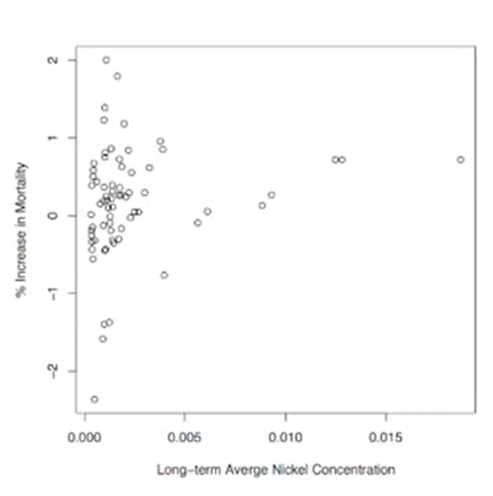


* Long-term average nickel concentrations appear correlated with PM risk
* There appear to be some outliers on the right-hand side (New York City)

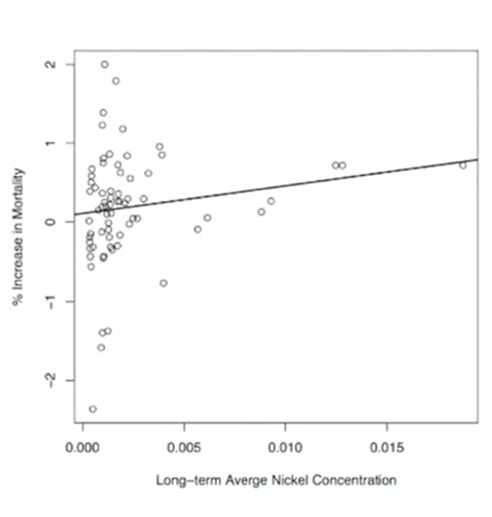

* Regression line statistically significant (*p* < 0.01)

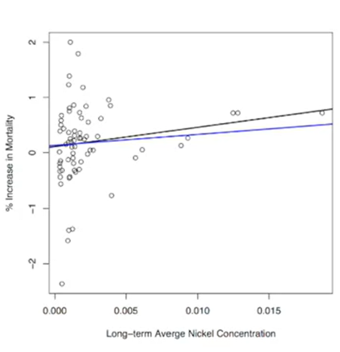

* Adjusted regression line (blue line) no longer statistically significant (*p* < 0.31)
* The adjusted regression line has removed the **high leverage points** - the three outliers representing 3 out of 5 counties in NYC

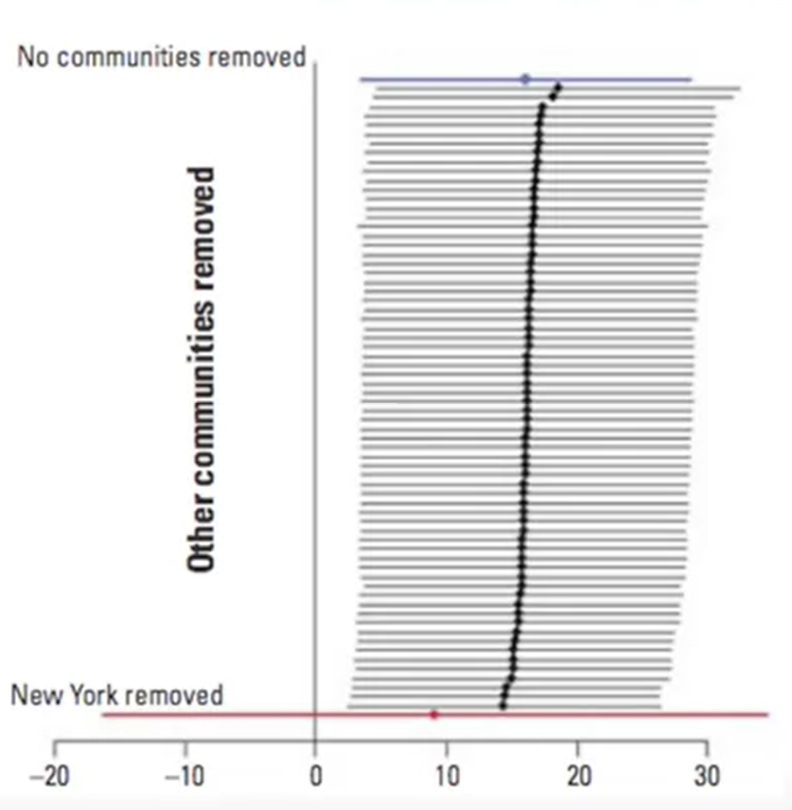

* Here are all of the slopes of the regression lines plotted by removing a single community
* We can see that only removing NYC has a significant impact on the analysis


## What have we learned?

* New York does have very high levels of nickel and vanadium, much higher than any other US community
* There is evidence of a positive relationship between Ni concentrations and *PM10* risk
* The strength of this relationship is highly sensitive to the observations from New York City
* Most of the information in the data is derived from just 3 observations

* Reproducibility of NMMAPS allowed for a secondary analysis (and linking with PM chemical constituent data) investigating a novel hypothesis (Lippmann *et al.*)
* Reproducibility also allowed for a critique of that new analysis and some additional new analysis (Dominici *et al.*)
* Original hypothesis not necessarily invalidated, but evidence not as strong as originally suggested (more work should be done)
* Reproducibility allows for the scientific discussion to occur in a timely and informed manner
* This is how science works


# Reproducible Research Case Study In High-Throughput Biology

Keith Baggerly and Kevin Coombes

## Why is RR so important in H-TB?

Our intuition about what "makes sense" is very poor in high dimensions. To use "genomic signatures" as biomarkers, we need to know they've been assembled correctly.

Without documentation, we may need to employ *forensic bioinformatics* to infer what was done to obtain the results.

Let's examine some case studies involving an important clinical problem: *can we predict how a given patient will respond to available chemotherapeutics?*


## Using the NCI60 to predict sensitivity

Note: The NCI60 is a standard panel of 60 cell lines maintained by the National Cancer Institute - all new chemotherapuetics are tested against the NCI60 and the results are publicly available.


Study - [Genomic signatures to guide the use of chemotherapeutics](https://pubmed.ncbi.nlm.nih.gov/17057710/)

The main conclusion is that we can use microarray data from cell lines (the NCI60) to define drug response "signatures", which can be used to predict whether patients will respond.

They provide examples using 7 commonly used agents.

This got people at MDA very excited.

But first ... Baggerly and Coombes wanted to reproduce the results. Starting with the most sensitive and most resistant cell lines they tried to fit the training data.

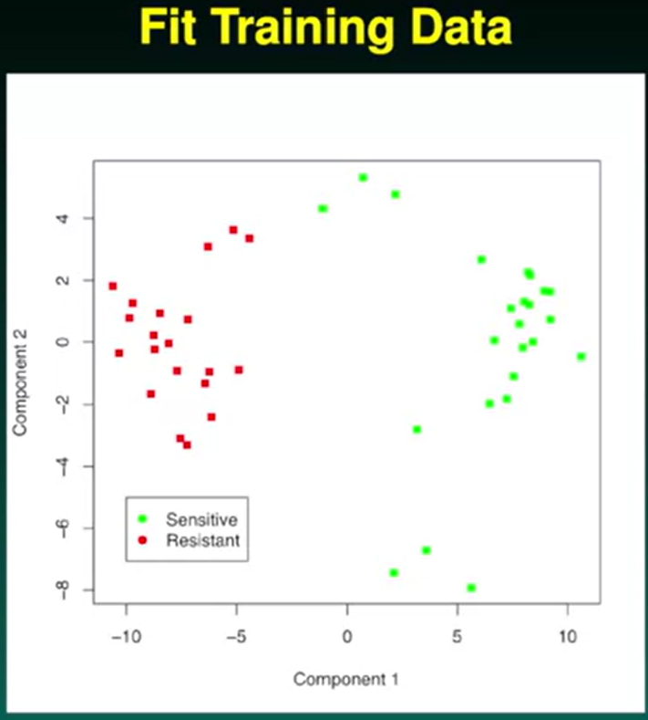

The plot shows a clear separation of the resistant ones on the left and the sensitive ones on the right. This is not surprising since this is the training set and the genes were picked precisely to achieve this separation. The aim is then to take clinical samples and project it into the same space and see the same separation. But as the plot below shows ... it doesn't!

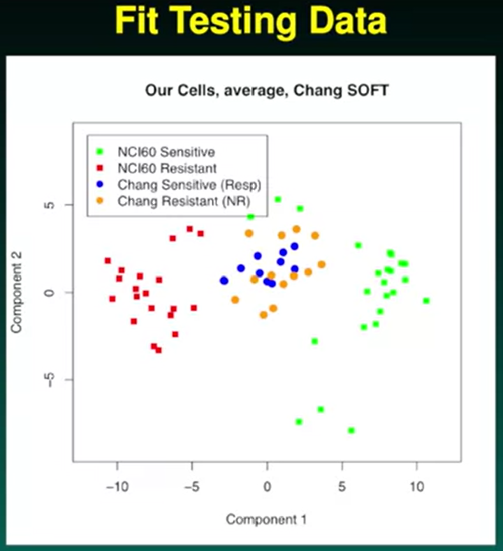

Did they do something wrong?

So they decided to try to reproduce the results reported in the Nature Medicine paper. They tried to reproduce thse heatmap on the left depicting 45 genes for 5-fluorouracil (a cytotoxic chemotherapy medication sued to treat cancer). The heatmaps shows extreme separation ... a pattern that is high in one group and low in the other for all 45 genes. The ran that with the tests and it looked OK, but then with the reported genes the pattern didn't show up ...

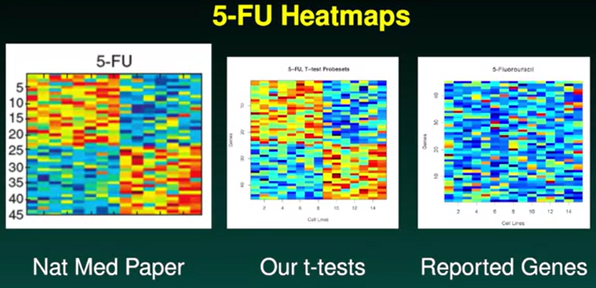

Now they were starting to get paranoid ... is there something wrong with the data? So they put the two lists of genes side by side ...

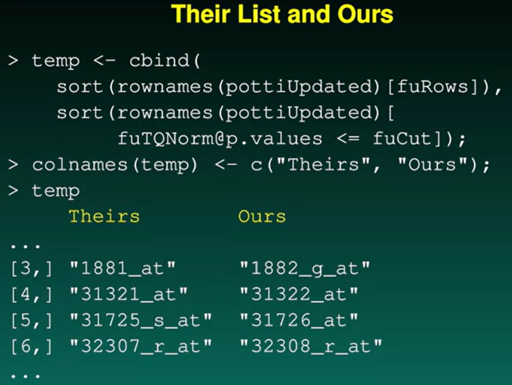

We can immediately appreciate an **off-by-one** indexing error. The authors are actually referencing a set of genes that are not involved. Since this is the case for one drug, but as the authors looked at 7, Braggerly and Coombes took the list of genes for the other 6 drugs, moved the index down by one and checked the p-values. This is what they got.

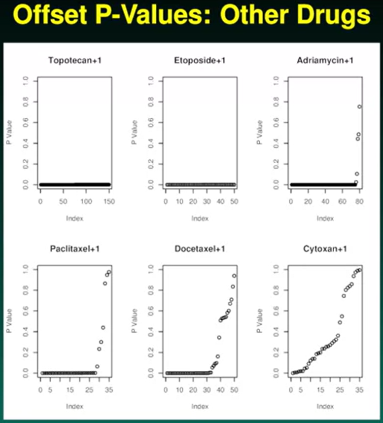

The first two are all off by one, the third, fourth and fifth are mostly off by one, whereas there is no explanation for the sixth.

So Braggerly and Coombes had identified a problem ... now they tried to figure out where it came from. They looked at the documentation of the software used in the study. Well ... there was none so they wrote it themselves!

### Using their software

The authors software requires two input files:

1. *a quantification matrix*, genes by samples, with a header giving classifications (0 = Resistant, 1 = Sensitive, 2 = Test)
2. *a list of probeset ids* in the same order as the quantification matrix. *This list must not have a header row.*

What do we get? Braggerly and Coombes tried to match the heatmaps for all drugs, but found that not all the gene lists matched.

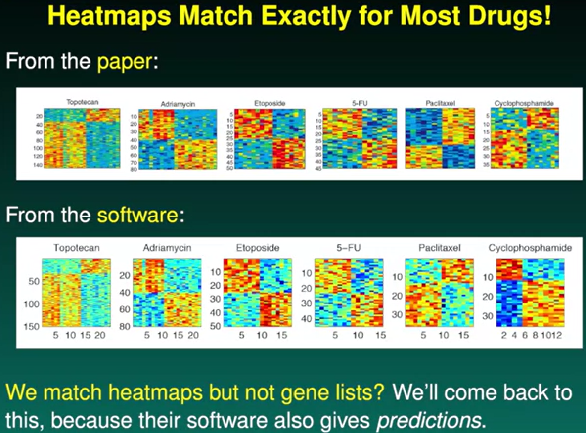

The authors reported accuracy rates for the predictions made on the sensitivity to the drugs. Braggerly and Coombes tried to obtain accuracy rates that were at least as good as those reported in the paper. Here they have done this with Docetaxel.

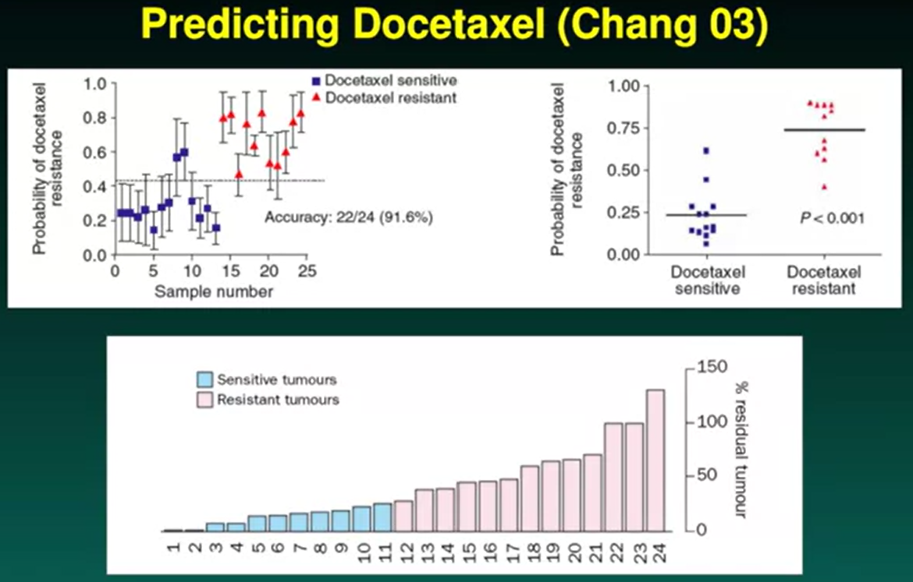

The top panel shows a good separation of sensitive (13) and resistant (11) genes. However, in a different study (bottom panel) 11 sensitive genes and 13 resistant genes were identified ... this discrepancy may be a problem, so Braggerly and Coombes looked at a different drug: Adriamycin.

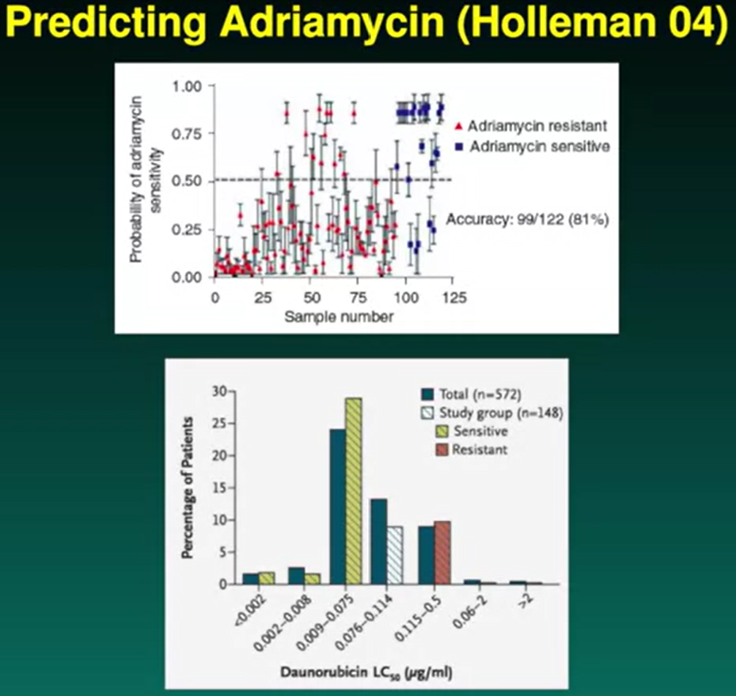

The top panel shows a predictor for a large number of resistant genes. However, Adriamycin is used in treating leukaemia and is actually quite effective. Indeed the bottom panel taken from another study shows that most genes are in fact sensitive to this drug.

So what is going on here? Looks like the authors have inverted sensitivity and resistance. What is the impact? Well, in the case of Adriamycin they would propose administering the drug only to those patients who would derive no benefit from it!

This then leads to the question: if the authors had everything backwards, how is it possible they were getting such good predictor scores? This brings us back to the point that the authors had included **some other genes** in the study? But which ones?

For the case of Docetaxel, the authors reported testing 50 genes. These overlapped with 31 in the data run by Braggerly and Coombes ... so where were the other 19 coming from? In the original paper (Chang et al) reporting the test data, those authors gave a list of 92 genes for separating resistance and sensitivity. 

Entries 7-20 in Chang et al's list comprise 14/19 outliers. The others (**ERCC1, ERCC4, ERBB2, BCL2L11, TUBA3**) are genes named in the paper to explain the biology.

So for Docetaxel, there are a group of genes used to split the training set, a group of genes used to split the test set and a group of genes to explain why it works ... with no overlap between the groups whatsoever. Braggerly and Coombes found this disturbing so they wrote to Nature Medicine and included all of the data and documentation of how they arrived at their conclusions.

Strangely enough, the response from the authors was that the work done by Braggerly and Coombes was flawed, the information for Adriamycin was available on the authors' website and that the authors had reproduced their approach twice in two other published papers.

Braggerly and Coombes managed to show that there were some obvious flaws in the Adriamycin data.

[Pharmacogenomic Strategies Provide a Rational Approach to the Treament of Cisplatin-Resistant Pateints With Advanced Cancer](https://ascopubs.org/doi/full/10.1200/JCO.2007.11.0593)

In this paper the same approach was adotped using **Cisplatin** and **Pemetrexed**.

For cisplatin, U133A arrays were used for training. **ERCC1, ERCC4 and DNA repair** genes are identified as "important.

With some work Braggerly and Coombes were able to match the heatmaps (after accounting for the off-by-one error that was still there) for 41 of the 45 genes reported. Unsurprisingly, the unmatched genes were:

* 203719_at, **ERCC1**
* 210158_at, **ERCC4**
* 228131_at, **ERCC1**
* 231971_at, **FANCM(DNA repair)**

The last two probesets are special.

These probesets aren't on the U133A arrays that were used. They are on the U133B.

## Some timeline here

Papers adopting the approach continued to appear throughout 2006-2008.

Around the middle of 2007 Braggerly and Coombes become aware of clinical trials being run adopting the approach.

**2007**: pemetrexed vs cisplatin, pemetrexed vs vinorelbine

**2008**: docetaxel vs doxorubicin, topotecan vs doxorubicin

Braggerly and Coombes quickly wrote a paper and had it published 14 September 2007.

Duke suspended the trials and carried out a review. When they completed the investigation they wrote that the results *strengthen ... confidence in this evolving approach to personalized cancer treatment.*

So Braggerly and Coombes asked to see the findings of the investigation, and were informed that Duke considered it a confidential document and that a future paper would explain the methods.


After a lot of wrangling (Braggerly and Coombes managed to get their hands on a redacted report from NCI under the freedom of information act), the clincal trials were finally suspended.

## Some observations

*The most common mistakes are simple.*

* Counfounding in the experimental design
* Mixing up the sample labels
* Mixing up the gene labels
* Mixing up the group labels
(Most mixups involve simple switches or offsets)

*This simplicity is often hidden.*

* Incomplete documentation

Braggerly and Coombes suspect that unfortunately *the most simple mistakes are common.*

## What should the norm be?

For papers? Recommendations:

* Data (often mentioned, given MIAME)
* Provenance
* Code
* Descriptions of nonscriptable steps
* Descriptions of planned desing, if used

For clinical trials? All of the above should be mandatory.

## Some lessons

Is our own work reproducible?

*Literate programming.* Reports prepared in **Sweave**

*Reusing templates.*

*Report structure.*

*Executive summaries.*

*Appendices.* Some things we want to know all the time: SessionInfo, Saves, and File Location.

The buzz phrase is **reproducible research.**


# Commentaries on Data Analysis

[Reproducible research can still be wrong: Adopting a prevention approach](https://www.pnas.org/doi/abs/10.1073/pnas.1421412111)

[What is the question?](https://www.science.org/doi/abs/10.1126/science.aaa6146)